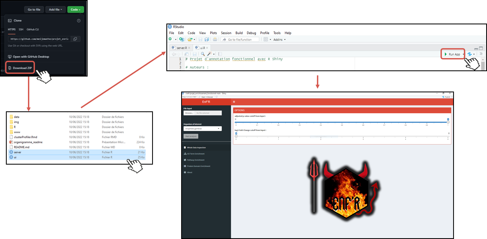

# Enrichissement Fonctionnel avec R

## Table des matières 
Présentation du projet :   
[Contexte et objectif(s)](#1)  
[L'équipe EnF'R](#2)  
Organsation des fichiers & lancement de l'application :    
[Description de l'espace GitHub](#3)  
[Installation et lancement de l'application](#4)  
[Format des données](#5)  
[Erreurs communes](#7)  
Bibliographie :   
[Données](#8)  
[Packages & logiciels](#9)  
[How to cite](#10)  

## Présentation du projet 
### Contexte et objectif(s) 

Ce projet correspond à l'évaluation de l'UE UE5 Bioinformatique en Sciences Omiques 3 – Analyse de données de séquençage NGS et annotation du master BIMS de l'Université de Rouen Normandie. 

Le but de ce projet est de coder une application web en R Shiny pour en faire un outil d'enrichissement fonctionnel en transcriptomique. Cet outil prend en entrée une matrice de comptage issue d’une expérience de séquencage ARNm (DEG) et retourne les résultats d'enrichissement fonctionnel avec des représentations graphiques associées.

### L'équipe EnF'R 

L'équipe se nomme **EnF'R** qui signifie **En**richissement **F**onctionnel avec **R**. Elle est consituée de 4 membres, tous étudiants dans le master BIMS l'Université de Rouen Normandie. 

MATHE Meije : meije.mathe@univ-rouen.fr  
PETY Solene : solene.pety@etu.univ-rouen.fr  
LETERRIER Bryce : bryce.leterrier@univ-rouen.fr  
OLLIVIER Louis : louis.ollivier@etu.univ-rouen.fr  

## Détails sur les fichiers / dossiers 

### Description de l'espace GitHub 

Voici comment s'organise l'espace de dépôt GitHub. Les scripts à executer (ui.R et server.R) sont dans le dossier principal. Des fichiers d'exemple sont disponibles dans le dossier data. Le dossier R contient 2 scripts R :  stats.R qui correspond aux fonctions qui étaient demandées d'être codées à la main et cluster_profiler.R qui regroupe des fonctions utilisant cluster profiler permettant de garder le script principal propre. Pour finir, les dossiers img et www contient des images utilisées dans ce readme et/ou dans le script (logo, gif de loader, ...)

### Installation et lancement de l'application 

NOTE 1 : il est recommandé d'installer les packages une première fois avant de lancer l'application. En effet, il y a beaucoup de packages utilisés donc cette partie prendra un certain temps. 

NOTE 2 : l'application tourne pour des version antérieurs (ou égale) à la version 4.1.2 du au package plotly qui n'est pas encore à jour avec cette version. 

Afin d'utiliser l'application simplement, il faut tout d'abord télécharger l'archive contenant tous les fichiers source. Ensuite il faut lancer les fichiers ui.R et server.R et cliquer sur Run App. L'application Shiny se lancera et il sera possible d'upload les données à analyser.

Voir parties suivantes pour l'utilisation en détail et eventuelles erreurs.
  
### Format des données 

Les données d'entrée doivent suivre un format bien précis, tout manque résultat en une erreur qui empechera le lancera de l'application. Les données doivent être au format .csv avec des noms de colonnes similaire à l'image suivante ainsi que dans le même ordre. 

Exemple de format requis :   

De plus, l'application ne fonctionne qu'avec des ensemblID. Il n'est pas possible d'utiliser de NCBIID pour le moment.

### Erreurs communes 

- Vérifier d'avoir la bonne version de R : utiliser la commande sessioninfo(), la version doit être antérieur (ou égale) à 4.1.2 ;
- Sous Linux : il peut être nécessaire d'installer au préalable certaines librairies : libcurl4-openssl-dev et libssl-dev. Utliser les commandes sudo apt install libcurl4-openssl-dev et/ou sudo apt install libssl-dev ;
- Vérifier de bien avoir une connextion internet stable, notamment pour l'installation des packages, qui peut être lourde ;
- Il se peut qu'une erreur soit levée à cause du package OrgDB, cela ne cause pas de soucis pour la suite ;  
- Il faut bien vérifier d'avoir mis le bon organisme pour les données à analyser, aucune vérification n'a été faite.
  
## Bibliographie
### Données 

Schultheiß C, Paschold L, Willscher E, et al. Maturation trajectories and transcriptional landscape of plasmablasts and autoreactive B cells in COVID-19. Iscience. 2021 Nov;24(11):103325. DOI: 10.1016/j.isci.2021.103325. PMID: 34723157; PMCID: PMC8536484.

### Packages & logiciels 

**R** : R version 4.1.2 (2021-11-01) -- "Bird Hippie"

**RStudio** :  
  2021.09.1 Build 372
  © 2009-2021 RStudio, PBC
  "Ghost Orchid" Release (8b9ced18, 2021-11-08) for Ubuntu Bionic
  Mozilla/5.0 (X11; Linux x86_64) AppleWebKit/537.36 (KHTML, like Gecko) QtWebEngine/5.12.8 Chrome/69.0.3497.128 Safari/537.36

Packages :  
**shiny** :     
  Winston Chang, Joe Cheng, JJ Allaire, Carson Sievert, Barret Schloerke, Yihui
  Xie, Jeff Allen, Jonathan McPherson, Alan Dipert and Barbara Borges (2021).
  shiny: Web Application Framework for R. R package version 1.7.1.
  https://CRAN.R-project.org/package=shiny

**shinydashboard** :  
  Winston Chang and Barbara Borges Ribeiro (2021). shinydashboard: Create
  Dashboards with 'Shiny'. R package version 0.7.2.
  https://CRAN.R-project.org/package=shinydashboard
  
**shinybusy** :  
  Fanny Meyer and Victor Perrier (2022). shinybusy: Busy Indicators and
  Notifications for 'Shiny' Applications. R package version 0.3.0.
  https://CRAN.R-project.org/package=shinybusy

**shinycssloaders** :  
  Andras Sali and Dean Attali (2020). shinycssloaders: Add Loading Animations to
  a 'shiny' Output While It's Recalculating. R package version 1.0.0.
  https://CRAN.R-project.org/package=shinycssloaders

**shinyjs** :  
  Dean Attali (2021). shinyjs: Easily Improve the User Experience of Your Shiny
  Apps in Seconds. R package version 2.1.0.
  https://CRAN.R-project.org/package=shinyjs

**shinyalert** :  
  Dean Attali and Tristan Edwards (2021). shinyalert: Easily Create Pretty Popup
  Messages (Modals) in 'Shiny'. R package version 3.0.0.
  https://CRAN.R-project.org/package=shinyalert

**biomaRt** :  
  Mapping identifiers for the integration of genomic datasets with the
  R/Bioconductor package biomaRt. Steffen Durinck, Paul T. Spellman, Ewan Birney
  and Wolfgang Huber, Nature Protocols 4, 1184-1191 (2009).

  BioMart and Bioconductor: a powerful link between biological databases and
  microarray data analysis. Steffen Durinck, Yves Moreau, Arek Kasprzyk, Sean
  Davis, Bart De Moor, Alvis Brazma and Wolfgang Huber, Bioinformatics 21,
  3439-3440 (2005).
  
**Biostrings** :  
  H. Pagès, P. Aboyoun, R. Gentleman and S. DebRoy (2019). Biostrings: Efficient
  manipulation of biological strings. R package version 2.54.0.

**biomartr**  :  
  Drost HG, Paszkowski J. Biomartr: genomic data retrieval with R. Bioinformatics (2017) 33(8): 1216-1217. doi:10.1093/bioinformatics/btw821.

**stringr** :  
  Hadley Wickham (2019). stringr: Simple, Consistent Wrappers for Common String
  Operations. R package version 1.4.0. https://CRAN.R-project.org/package=stringr

**stringi** :  
  Gagolewski M (2021). “stringi: Fast and portable character string processing in
  R.” _Journal of Statistical Software_. to appear.

  Gagolewski M (2021). _stringi: Fast and portable character string processing in
  R_. R package version 1.7.6, <URL: https://stringi.gagolewski.com/>.

**DT** :  
  Yihui Xie, Joe Cheng and Xianying Tan (2022). DT: A Wrapper of the JavaScript
  Library 'DataTables'. R package version 0.22.
  https://CRAN.R-project.org/package=DT

**plotly** :  
  C. Sievert. Interactive Web-Based Data Visualization with R, plotly, and shiny.
  Chapman and Hall/CRC Florida, 2020.

**htmlwidgets** :  
  Ramnath Vaidyanathan, Yihui Xie, JJ Allaire, Joe Cheng, Carson Sievert and
  Kenton Russell (2021). htmlwidgets: HTML Widgets for R. R package version
  1.5.4. https://CRAN.R-project.org/package=htmlwidgets

**clusterProfiler** :   
  Guangchuang Yu, Li-Gen Wang, Yanyan Han and Qing-Yu He. clusterProfiler: an R
  package for comparing biological themes among gene clusters. OMICS: A Journal
  of Integrative Biology 2012, 16(5):284-287
  
**pathview** :     
  Luo, W. and Brouwer C., Pathview: an R/Bioconductor package for pathway-based
  data integration and visualization. Bioinformatics, 2013, 29(14): 1830-1831,
  doi: 10.1093/bioinformatics/btt285
  
**ReactomePA** :  
  Guangchuang Yu, Qing-Yu He. ReactomePA: an R/Bioconductor package for reactome
  pathway analysis and visualization. Molecular BioSystems 2016, 12(2):477-479

**AnnotationHub** :    
  Martin Morgan (2019). AnnotationHub: Client to access AnnotationHub resources.
  R package version 2.18.0.

**enrichplot** :      
Guangchuang Yu (2019). enrichplot: Visualization of Functional Enrichment
  Result. R package version 1.6.1. https://github.com/GuangchuangYu/enrichplot

**topGO** :    
Adrian Alexa and Jorg Rahnenfuhrer (2019). topGO: Enrichment Analysis for Gene
  Ontology. R package version 2.38.1.

**ggplot2** :    
H. Wickham. ggplot2: Elegant Graphics for Data Analysis. Springer-Verlag New
  York, 2016.

**DOSE**  :   
Guangchuang Yu, Li-Gen Wang, Guang-Rong Yan, Qing-Yu He. DOSE: an
  R/Bioconductor package for Disease Ontology Semantic and Enrichment analysis.
  Bioinformatics 2015 31(4):608-609

**shinycustomloader**  :  
Emi Tanaka and Niichan (2018). shinycustomloader: Custom Loader for Shiny Outputs. R package version 0.9.0. https://CRAN.R-project.org/package=shinycustomloader

## How to cite <a name="10">
EnF'R : an R Shiny application for functional enrichment analysis. Louis Ollivier, Bryce Leterrier, Meije Mathé, Solène Pety, Stéphanie Levon, Nicolas Vergne, Hélène Dauchel, master bioinformatics, 2022, Rouen Normandy Univerity, FRANCE
